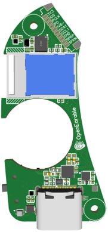

OpenEarable 2.0
==========================

Overview
--------
The OpenEarable 2.0 demo board is a development board featuring the Raytac MDBT53-1M module, utilizing the advanced Nordic Semiconductor nRF5340 ARM Cortex-M33 dual-core SoC. It is designed to facilitate research into ear-based wearable technologies, integrating a wide range of sensors and communication technologies for comprehensive physiological data collection.

The nRF5340 SoC embedded within offers:
- A fully-featured Arm Cortex-M33F core (application core) capable of running at up to 128 MHz, FPU, and Armv8-M Security Extension.
- A secondary Arm Cortex-M33 core (network core), optimized for network processing and running at a fixed 64 MHz.

Key Features:
- Bluetooth Low Energy (BLE) support with LE Audio capabilities.
- Extensive sensor integration including a 9-axis IMU, pulse oximeter, optical temperature sensor, and an ultrasonic sensor array.
- Open-source hardware and firmware designed under the Open Source Hardware Association (OSHWA) guidelines, using Zephyr OS.
- Advanced data logging and real-time data streaming capabilities via a custom web dashboard and mobile app support for both iOS and Android.

     OpenEarable 2.0 (Credit: KIT)

Hardware
--------
- Built around the MDBT53-1M module by Raytac, incorporating the nRF5340 SoC.
- Support for a wide array of protocols including Bluetooth® Low Energy, ANT+, Zigbee, and Thread, enhancing its utility in multi-protocol applications.
- Features like an on-board microSD card slot for data storage, programmable RGB LED for status indication, and a mini USB connector for power and programming.
- Dual-core architecture allowing for simultaneous application and network processing, optimizing power consumption and computational efficiency.

Supported Features
==================
- Multiple IO interfaces: SPI, I2C, UART, PWM, and ADC for versatile peripheral connections.
- Extensive sensor support through I2C interface facilitating integration of customized sensor modules.
- GPIOs fully mapped to pin headers for easy prototyping and integration into other systems or applications.

Security Components
-------------------
- IDAU implemented using the System Protection Unit to define secure and non-secure memory maps.
- Secure boot capabilities ensuring trusted application execution.

Programming and Debugging
-------------------------
- The board supports programming and debugging via an external SEGGER J-Link debugger.
- Provisioned with a USB interface for logging and runtime management through a dedicated RTT Console.

Flashing Instructions
=====================
1. Setup your environment by following the guidelines provided on the Nordic Semiconductor's Segger page.
2. Use the provided USB to TTL converter for serial communication setup.
3. Utilize the popular toolchains for building and flashing the Zephyr applications.

For comprehensive development guidelines and hardware details, visit the [official OpenEarable 2.0 project website](https://open-earable.teco.edu).

References
----------
- Zephyr RTOS: [Zephyr Project Documentation](https://zephyrproject.org)
- Nordic Semiconductor: [nRF5340 Product Specification](https://www.nordicsemi.com/Products/nRF5340)
- Raytac Corporation: [MDBT53-1M Information](https://www.raytac.com/product/ins.php?index_id=139)

